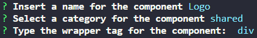
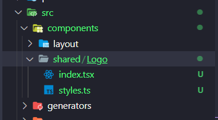

# Next JS Boilerplate

## Description

This boilerplate was created to be a fast quick start to develop websites. It comes with eslint, prettier, husky, lint-staged set up and more.

## Dependencies

[Styled Components](https://styled-components.com/)  
[NextJS](https://vercel.com/solutions/nextjs)  
[ESLint](https://eslint.org/)  
[Prettier](https://prettier.io/)  
[Husky](https://typicode.github.io/husky/#/)  
[Lint Staged](https://opencollective.com/lint-staged)
[Plop](https://plopjs.com/)

## Installation and Setup

To install this boilerplate you need to:

1. Install the dependencies

```sh
  yarn | npm install
```

2. Run the project for development

```sh
  yarn dev | npm run dev
```

3. To production build

```
  yarn build | npm run build
```

4. Run the production build

```
  yarn start | npm run start
```

# Generate new components using plop

To create new components you can:

1. Run the generate script

```
  yarn generate | npm run generate
```

2. Answer the questions  
   

3. Now the component has been successful generated  
   
